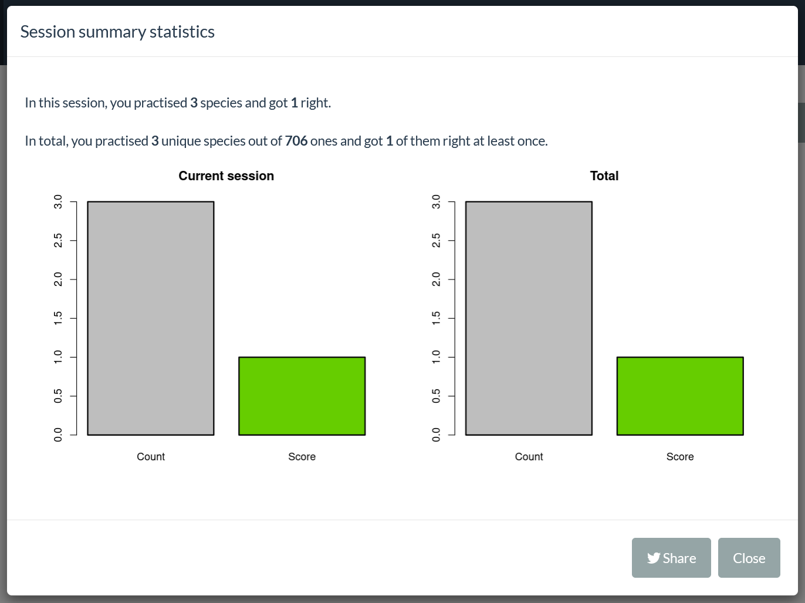

<style>
body {
text-align: justify}
</style>

```{r setup, include=FALSE}
knitr::opts_chunk$set(echo = TRUE, message = FALSE, warning = FALSE,
                      fig.width = 8, fig.height = 8)
# Packages --------------------------------------------------------------------
suppressPackageStartupMessages({
  suppressWarnings({
    library(BotanizeR)
  })
})

options(tinytex.verbose = TRUE)
```


# Overview

This tutorial illustrates how to use the BotanizeR Shiny application. It is
based on the following 
[instance](https://gift.uni-goettingen.de/shiny/BotanizeR/). 

When you load this webpage, you first arrive on the Quiz tab.

\newpage

# Quiz tab

Here you can practice your species identification skills in a playful way.
Pictures of a random species will appear on the screen. If several pictures are
available, you can switch pictures by clicking the left and right arrows on the
picture's side. 
<br>
On the left, several checkboxes are made available. When clicking them,
dedicated clues appear on the right side. On Figure 1, information about the
ecology and the clonality of the species are displayed. Sources of the pictures
are also available below these hints and the picture, and you can click them to
get redirected to the relevant websites.
<br>
To enter your answer, you need to write in the bar called 'Species name'. As
indicated below, to submit your answer you need to hit 'Enter' on your keyboard
or to click the 'Submit' button on the bottom. The app then tells you whether
your attempt was correct or by how many characters your answer is differing
from the truth. The app also recognizes whether you have guessed the right
genus of the species. If you cannot find what species it is, you can always
hit the arrow down on your keyboard or click the 'Answer' button to reveal the
species's name. Finding the answer, on your own or with the solution,
automatically shows you all the possible hints.To change species, you can click
the 'New plant' button or hit the arrow up on your keyboard. A new species will
then appear.


<br>

The quiz keeps track of the species shown and and of your score. This is useful
in two ways: first, the probability to pick a certain species will depend on
your score. The app will pick up more often species which you struggle to
identify and will tend to omit the ones you know. This feature can be disabled
in the Setup tab. Second, you can highlight you score and see in a graphical
way how much you performed. You can even share your score by using the Twitter
button (Figure 2).



Finally, on this tab, you have the opportunity to download the species list
after practicing and upload it again to make use of the saved numbers of
successes and failures when practicing again. This option is available by
clicking the button 'Upload/Download progress'.

\newpage

# Setup tab

In the Setup tab you can choose which species to practice, either by choosing from a predefined set of species lists or by uploading a customized species list. You can subset the species list by those species found in GBIF for a defined radius around a desired location. You can also define which hints and images to make available in the Species overview and Quiz tabs based on all the resources available in this instance of BotanizeR and hints you added to the species list.

\newpage

# Species tab

In the Species tab, you can retrieve all deposited information for each species.

\newpage

# References

Bundesamt für Naturschutz (BfN) [http://www.floraweb.de](http://www.floraweb.de)  

Image authors: [https://www.floraweb.de/ueberfloraweb/bildautoren.html](https://www.floraweb.de/ueberfloraweb/bildautoren.html)


