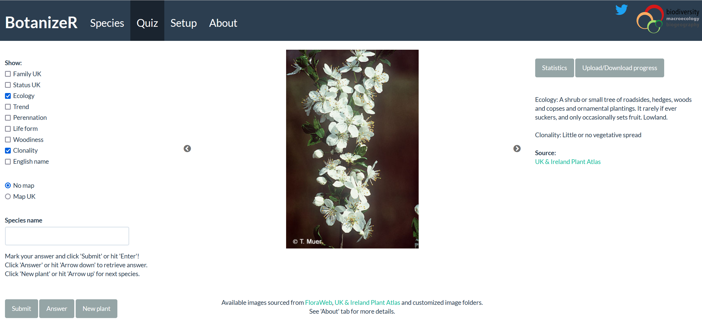

<style>
body {
text-align: justify}
</style>

```{r setup, include=FALSE}
knitr::opts_chunk$set(echo = TRUE, message = FALSE, warning = FALSE,
                      fig.width = 7, fig.height = 5)
# Packages --------------------------------------------------------------------
suppressPackageStartupMessages({
  suppressWarnings({
    library(BotanizeR)
  })
})

options(tinytex.verbose = TRUE)
```


# Overview  

BotanizeR is an R-package with Shiny app designed to help botany students and 
other people interested in plants to learn and distinguish plant diagnostic 
characters, memorize plant species, and train their identification skills. 
Students can browse a species list, images, plant characteristics, habitat 
descriptions and distribution information or play a quiz where images of a 
random species are shown and students have to guess the correct species.

Lecturers can flexibly define their own species lists and provide images and 
further useful information, or choose from linked online content from selected 
botanical online resources to show in BotanizeR. In this Tutorial, we explain 
how to create own content to present in BotanizeR and how to customize the 
Shiny app.

\newpage


# Species List

A new species list for BotanizeR needs to be a `data.frame` containing at least 
the following columns: *NAMNR*, *TAXONNAME*, *SPECIES* and *GENUS*. The *SPECIES* 
column includes the species name (genus and epithet; character or factor) to be 
guessed and looked up in the online resources or image folders. The *TAXONNAME* 
column includes the full species name including additional information like, 
for example the authority (character or factor). The *GENUS* column includes 
the corresponding genus name (character or factor). *NAMNR* contains the ID 
(numeric) of the species used by [FloraWeb](https://www.floraweb.de). In 
case FloraWeb content is not retrieved, this may be NA.

In addition, the species list  should include the numeric columns *COUNT*, 
*SCORE* and *ATTEMPTS* where the number of times a species was 
practiced, how often it was guessed correctly and how many attempts were needed 
will be recorded. At the start these columns include zeros only. In addition, 
the column *INCLUDE* indicates whether a species shall be included in the app 
or not. Here, the default value is 1.

In addition, the species list may contain columns to filter by, as 
well as columns including own descriptive hints (named like 
*ownhint_Description*, *ownhint_Distribution*, etc.) and links (URLs) to images 
(*imagelink_1*, *imagelink_2* etc.). These columns can be filled by the 
lecturer in advance but can also be modified and expanded by the student 
after downloading the list.

The R package includes an example species list 
containing the relevant information to run `BotanizeR_quiz` or the BotanizeR 
Shiny app for 5852 vascular plant species from 
[FloraWeb](https://www.floraweb.de) and the 
[Online Atlas of the British Irish flora](https://www.brc.ac.uk/plantatlas/).


```{r Installation, eval=FALSE}
library(BotanizeR)
```
```{r BotanizeR_species}
data(BotanizeR_species)
BotanizeR_species[c(13:15), 
                  c("NAMNR", # FloraWeb ID
                    "TAXONNAME","SPECIES","GENUS", # Names to display and guess
                    "UK_Ireland", "Germany", # Columns to make subsets
                    "COUNT", "SCORE", "ATTEMPTS", "INCLUDE", # Quiz controls            
                    "ownhint_English_name", "ownhint_Description", # Own hints
                    "imagelink_1", "imagelink_2")] # Own image links
```
\newpage


# Images

Images can be supplied like indicated above by including image URLs into 
dedicated columns of the species list, or by supplying local folders with 
jpg or png images. When running the Shiny app locally (on the students 
computer) these folders need to be on the local computer. If the Shiny app is 
running on a server, these folders can be supplied by the lecturer on the 
server (see below).

In addition, Images can be sources from selected online resources currently
incorporated into BotanizeR: [FloraWeb](https://www.floraweb.de) and the 
[Online Atlas of the British Irish flora](https://www.brc.ac.uk/plantatlas/).
All images, from own image links, image folders, or online resources are 
collected for use in BotanizeR by the `BotanizeR_collect()` function which is 
called within the Shiny app and `BotanizeR_quiz()`:

```{r BotanizeR_collect, fig.width = 7, fig.height = 4}
# Select Acer campestre as example species
species_row = BotanizeR_species[which(BotanizeR_species$SPECIES ==
                                        "Acer campestre"),]


# Load images: UK plant atlas, FloraWeb and own image links
hints <- BotanizeR_collect(species_row, image_floraweb = TRUE, 
                           image_ukplantatlas = TRUE, 
                           imagelinks_custom = c("imagelink_1","imagelink_2"))

par(mfrow=c(2,3), mar = rep(0.2, 4), oma = rep(0, 4))
plot(hints$image[[1]], axes = FALSE)
plot(hints$image[[2]], axes = FALSE)
plot(hints$image[[3]], axes = FALSE)
plot(hints$image[[4]], axes = FALSE)
plot(hints$image[[5]], axes = FALSE)
plot(hints$image[[6]], axes = FALSE)


# To load images from your local computer, specify an image folder with
# pictures included.

## Not run: 
hints <- BotanizeR_collect(species_row, 
                           image_folders = c("images/Asteraceae_Britain",
                                             "images/Trees"))
## End(Not run)
```
\newpage


# Descriptive hints

Descriptive hints are drawn from the ownhint columns of the species list 
data.frame as indicated above or from selected online resources currently
incorporated into BotanizeR: [FloraWeb](https://www.floraweb.de) and the 
[Online Atlas of the British Irish flora](https://www.brc.ac.uk/plantatlas/).
Again this information is collected by `BotanizeR_collect()` inside
the Shiny app and `BotanizeR_quiz()`:

```{r BotanizeR_collect_hints}

# Load hints: UK plant atlas, FloraWeb and own hints 
hints <- BotanizeR_collect(species_row,
                           hints_floraweb = c("description", 
                                              "status", "habitat", 
                                              "family", "German name"),
                           hints_ukplantatlas = c("familyuk", 
                                                  "ecology", "statusuk", 
                                                  "trends", "perennation",
                                                  "lifeform", "woodiness", 
                                                  "clonality"),
                           hints_custom = c("ownhint_English_name", 
                                            "ownhint_Description", 
                                            "ownhint_Distribution"))
hints$statusuk
hints$clonality
hints$lifeform
```
\newpage


# BotanizeR Shiny app

## Getting started

The most convenient way to play the BotanizeR quiz and to study selected plant 
species based on images and descriptions is the BotanizeR Shiny app. When the 
BotanizeR R package is installed, the Shiny application can be started locally 
using the function `BotanizeR_shiny()`. Alternatively, one can clone the 
BotanizeR GitHub repository (https://github.com/patrickweigelt/BotanizeR) and 
run the shiny app from RStudio. This option offers most flexibility for 
modifying the app as all code can easily be changed. For teaching purposes the 
Shiny app would ideally be set up on a shiny server which students can visit 
online. 

A useful tutorial for setting up a shiny server can be found here:
https://www.digitalocean.com/community/tutorials/how-to-set-up-shiny-server-on-ubuntu-16-04

A comprehensive example instance of BotanizeR showcasing all functionality can 
be found at https://gift.uni-goettingen.de/shiny/BotanizeR/ 

```{r, fig.label = "Figure 1. BotanizeR Quiz tab", out.width = "100%", echo = FALSE}

```


## Config files

In order to customize the BotanizeR Shiny app, the config.R file in the Shiny 
App's folder can be modified. Here one can define, which species lists 
and resources to use, what settings to start with and what setup options to 
make available in the app. The BotanizeR Shiny folder includes a 
config_default.R and a config.R files Changes to the configuration should be 
made in config.R. Variables not defined will be drawn from config_default.R  


Here, we go step by step through the variables set in the config files:

### Setup

Shall the setup tab be shown in the app allowing students to choose from 
available species lists, images and descriptive hints to show or shall the 
setup tab be hidden?

```{r BotanizeR_setup_1}
setup <- TRUE 
# Set to FALSE if setup tab shall be hidden.
```

Shall online resources in setup tab be shown or shall only custom images and 
hints be available to activate and deactivate?


```{r BotanizeR_setup_2}
online_resources <- TRUE 
# Set to FALSE if content from online resources like www.floraweb.de or  
# https://www.brc.ac.uk/plantatlas/ shall be removed from setup tab.
```


Shall the option to subset the species list(s) by [GBIF](https://www.gbif.org/) 
occurrences be available in the setup tab?

```{r BotanizeR_setup_3}
gbif <- TRUE
# Set to FALSE if the option to subset the provided backbone species lists by 
# gbif occurrences for a user-defined radius around user-defined coordinates
# shall not be available in the setup tab.
```

Shall species in the quiz be sampled based on probabilities updated depending 
on students successes and failures?

```{r BotanizeR_setup_4}
dynamic_probabilities <- TRUE
# Set to FALSE if species in the quiz shall be drawn with equal probabilities 
```

Do you want to include a Google analytics ID to track traffic to your BotanizeR 
instance?

```{r BotanizeR_setup_5}
analytics <- FALSE
# Put your Google analytics ID as character string (e.g. "UX-123456789-1") if 
# you want to evaluate access to your BotanizeR instance. 
```


BotanizeR URL for tweeting about BotanizeR on Twitter:  

```{r BotanizeR_setup_6}
BotanizeR_URL <- ""
# Provide the URL of your BotanizeR instance 
# (e.g. "https://gift.uni-goettingen.de/shiny/BotanizeR/") to be included in 
# twitter tweets produced from inside the app
```


Does your setup require adding a folder location to all relative paths used in 
the app (species list location, image locations)? 

```{r BotanizeR_setup_7}
system_path <- ""
# If so, add it as a character string here (e.g. "~/ShinyApps/BotanizeR/")
# Not needed under normal setup conditions
```

```{r, fig.label = "Figure 1. Setup tab", out.width = "100%", echo = FALSE}
knitr::include_graphics("../man/figures/BotanizeR_printscreen3.png")
```


### Species list  

File  

Provide a csv file (system_path defined above will be added in front) of the 
backbone species list used in BotanizeR. If not 
supplied (`species_list_path <- ""`), `BotanizeR_species.rda` from the 
BotanizeR R package including a comprehensive species list of Germany and Great 
Britain will be loaded.

```{r BotanizeR_list_1}
species_list_path <- ""
# Add filepath/name of your species list as character string here (e.g. 
# "species_list.csv")
```

Species list filters  

Define Species list filters, i.e. columns by which the backbone species list 
can be filtered by the student. These columns need to be numeric including 0 
and 1 indicating whether or not to include a species in the given subset (e.g. 
c("Region_A","Orchidaceae")). If set to "All species" the only option shown in 
the species list drop down of the setup tab will be "All species" and no 
filtering will be possible.

```{r BotanizeR_list_2}
species_list_filter <- "All species"
# Change according to the filtering columns in your species list
# species_list_filter <- c("All species", "Germany", "UK_Ireland")
```

Selected species list  

Define which species list subset shall be selected at the start. If set to 
"All species" no filter will be applied.

```{r BotanizeR_list_3}
species_list_selected <- "All species" 
# Needs to be one out of species_list_filter
```

### Hints and images  

Images from online resources  

Indicate whether images from [FloraWeb](https://www.floraweb.de) and/or the 
[Online Atlas of the British Irish flora](https://www.brc.ac.uk/plantatlas/) 
shall be shown from the start. If set to FALSE but setup and online_resources 
are set to TRUE, the online resources can be activated by the user within the 
setup tab.

```{r BotanizeR_hints_1}
image_floraweb <- TRUE
image_ukplantatlas <- TRUE
# Set to FALSE if online resources shall not be available from the start on
```

Images folders  

Provide the path to folders including images of the target species to show
in the BotanizeR app at the start. The images inside the folder need to 
include the species names in their file names using " " or "_" to delimit 
genus and epithet.

```{r BotanizeR_hints_2}
image_folders <- NULL
# Change for example to c("WWW/pictures_Angiosperms","WWW/drawings_Region_A")
# The system_path defined above will be added in front
```

Images from image link columns

Indicate columns in the species list with URLs of images online to be shown
in BotanizeR at the start. Column names need to be named like imagelink_1, 
imagelink_2 etc. and can be enabled and disabled in the setup tab if setup is 
set to TRUE above.

```{r BotanizeR_hints_3}
imagelinks_custom <- NULL
# Change for example to c("imagelink_1", "imagelink_2")
```

Hints from online resources

Indicate which of the hints available from [FloraWeb](https://www.floraweb.de) 
and/or the 
[Online Atlas of the British Irish flora](https://www.brc.ac.uk/plantatlas/) 
shall be shown from the start. If set to NULL but setup and online_resources 
are set to TRUE, the online hints can be activated by the user within the setup 
tab.

```{r BotanizeR_hints_4}
hints_floraweb <- c("map","description", "status", "habitat", "family",
                   "German name")

hints_ukplantatlas <- c("mapuk","familyuk","ecology","statusuk","trends",
                       "perennation","lifeform","woodiness","clonality")
# Set to NULL if online hints shall be disabled at the start
```

Hints from own hint columns

Indicate columns with descriptive hints that shall be shown from the start. 
Column names need to be named like ownhint_HintName. If set to NULL but setup
is to TRUE above, the hints can be activated by the user within the setup tab.

```{r BotanizeR_hints_5}
hints_custom <- NULL
# Change for example to  c("ownhint_English_name")
```

### About

The about tab contains two paragraphs specifically about the given instance of 
BotanizeR. Add text (html) describing your instance of BotanizeR and your 
sources of images, hints and species lists to be shown in addition to our 
general description of the app in the about tab. For more fundamental changes,
modify about.R directly.

```{r BotanizeR_about}
instance_description <- 
  'This particular instance of the BotanizeR Shiny app...' 

instance_credits <- 
  'This instance of BotanizeR retrieves images and information from 
  <a href="https://www.floraweb.de/" target=_blank>FloraWeb</a> and the 
  <a href="https://www.brc.ac.uk/plantatlas/" target=_blank>
  UK & Ireland Plant Atlas</a>. 
  Please visit these websites for more information about sources and 
  image authors'
# Change according to your needs
```

# References

Bundesamt für Naturschutz (BfN): 
[http://www.floraweb.de](http://www.floraweb.de)  
Image authors: 
[https://www.floraweb.de/ueberfloraweb/bildautoren.html](https://www.floraweb.de/ueberfloraweb/bildautoren.html)

Online Atlas of the British and Irish flora: 
[https://www.brc.ac.uk/plantatlas/](https://www.brc.ac.uk/plantatlas/)  
Image authors: 
[https://www.brc.ac.uk/plantatlas/content/photos](https://www.brc.ac.uk/plantatlas/content/photos)  


